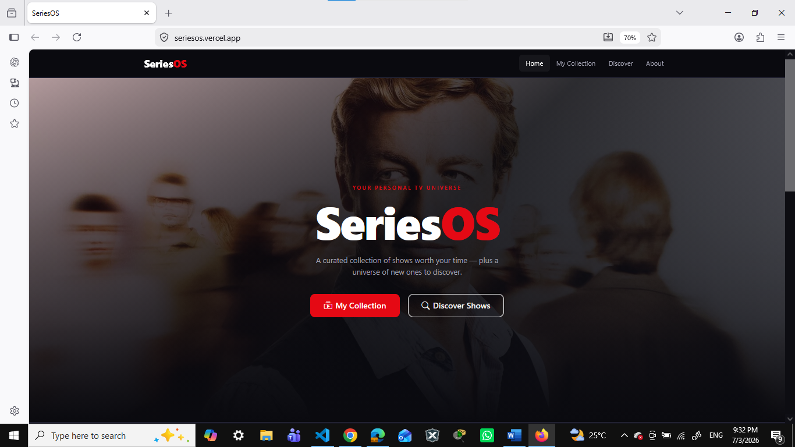
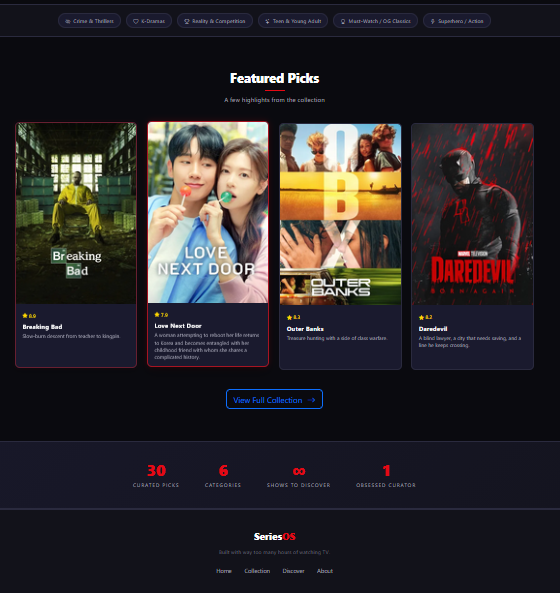
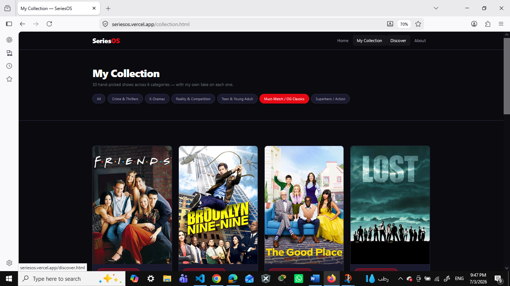
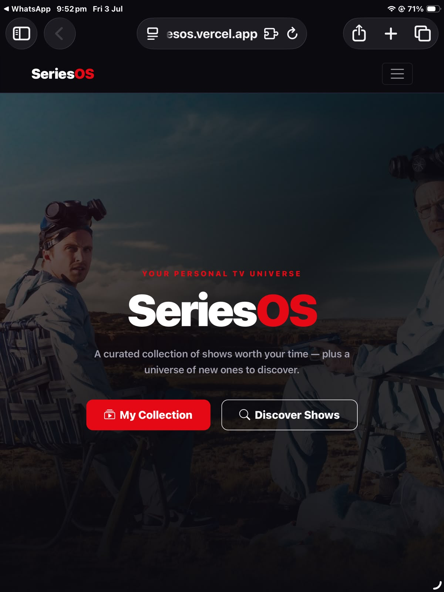
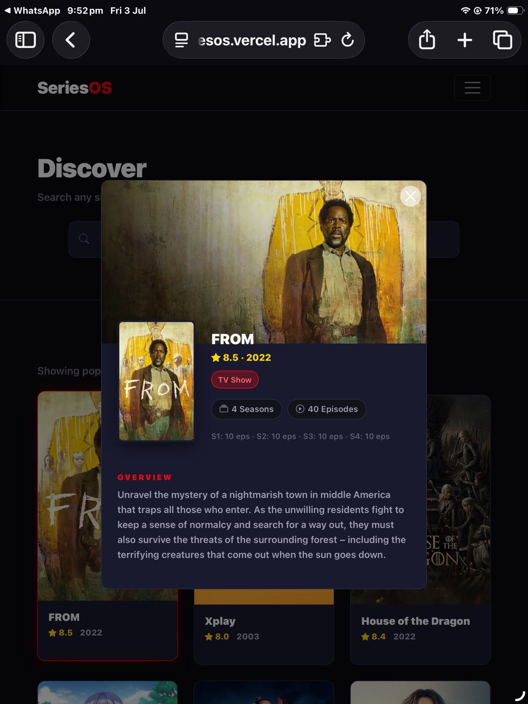
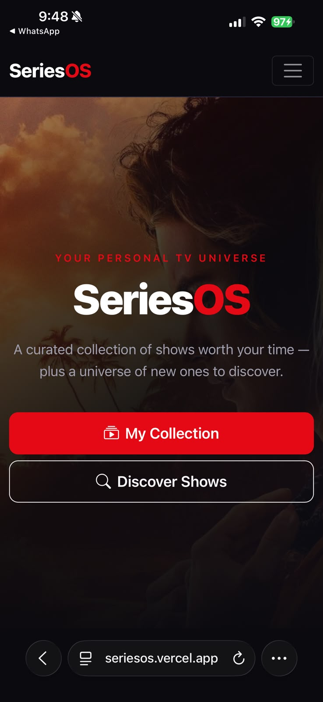
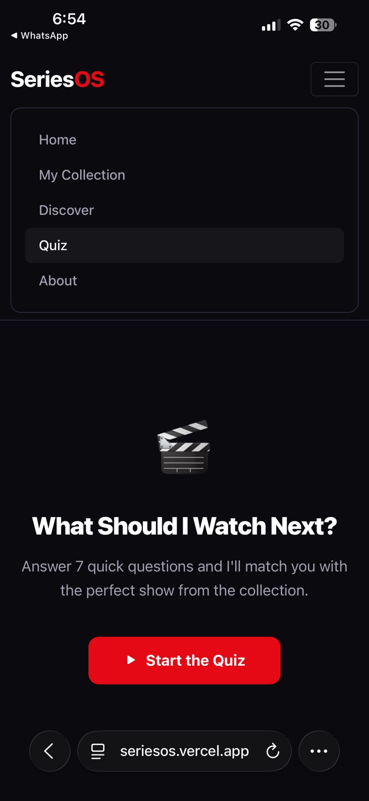

# SeriesOS

**Name:** Michelle Barakat  
**Course:** Full Stack Development — Final Project 2026  
**Live URL:** https://seriesos.vercel.app  
**GitHub:** https://github.com/michellebarakat/seriesos

---

## Description

SeriesOS is a personal TV show tracking and discovery site. It has two main sections:

- **My Collection** — 30 hand-picked shows I've personally watched, organized into 6 categories (Crime & Thrillers, K-Dramas, Reality & Competition, Teen & Young Adult, Must-Watch / OG Classics, Superhero / Action), each with my own blurb and personal review. Poster images, ratings, seasons, episode counts, and next season info are fetched live from the TMDB API.
- **Discover** — A TMDB-powered search page where you can search any TV show, with pagination and a modal detail view for each result.

The home page features a rotating hero background that cycles through show backdrops every 10 seconds, a featured picks section, and a stats bar.

---

## API Used

**The Movie Database (TMDB) API** — https://www.themoviedb.org/

Used for: poster images, backdrop images, official ratings, show details (seasons, episodes, next season air date), movie runtime, and the Discover search functionality.

---

## Custom UI Requirement

**Implement a modal popup for a detailed item view**

Every card in both the Collection and Discover pages opens a full modal showing:
- A backdrop hero image
- Poster thumbnail overlapping the backdrop
- Title, rating, and year
- Number of seasons and total episodes
- Episodes per season breakdown (e.g. S1: 10 eps · S2: 8 eps)
- Next season air date if one is announced
- Movie runtime for movies
- TMDB synopsis
- My personal review (Collection page only)

The modal closes on the × button, backdrop click, or Escape key. Implemented using Bootstrap 5's Modal component wired through ES6 class methods in `collection.js` and `discover.js`.

---

## AI Use Appendix

### Tools Used
- **Claude (Anthropic)** — used throughout the project for planning, code generation, debugging, and feature implementation.

### Prompts I Used

1.	*" i have a full stack project. the requirement is a website with at least 3 pages, an api that needs a key, my own curated content of 15+ items, and a modal popup for detailed view which is my unique requirement. i watch a LOT of series,  over 150 shows, so i was thinking of doing something related to that. i want the site to look good, creative and unique, not something that looks basic or like a template. i was thinking dark theme, something cinematic like netflix but more personal, with my own reviews and opinions on the shows i picked. i also want a separate page where people can search any show using an api. can you help me figure out the structure, what pages to have, what api to use, and how to make it look good and stand out ?"* 

→ This shaped the entire concept — the decision to split into a personal curated collection and an API-powered discover page, the dark cinematic theme, using TMDB as the API, and the overall 4-page structure (Home, Collection, Discover, About). 

2.	*"The hero section on the home page right now has a static background image and its fine but i feel like it could be so much better. i want it to automatically change every 6 seconds to a different show backdrop, like it cycles through multiple images. and i dont want it to be a hard cut between images, i want it to be a smooth fade transition so it looks clean and cinematic. also the images should come from tmdb using the api, not local files i download myself, because that way they will always be high quality official images. can u add this feature and also let me choose which shows backdrops it cycles through ?"* 

→ Led to the `loadBackdrops()` and `rotateBackdrop()` methods in `index.js`, fetching backdrop images from TMDB for a list of shows and cycling through them using `setInterval` at 10 second intervals with an opacity fade transition between images. 

3.	*"i want the modal that opens when u click a card to show a lot more information than just the poster and the description. specifically i want to know how many seasons the show has, and also a breakdown of how many episodes are in each season like S1: 10 eps, S2: 8 eps, S3: 10 eps so i can see the full picture. For movies instead of seasons show the total runtime formatted nicely like 1h 52min not just the number of minutes. all of this extra info should load after the modal opens so it doesnt slow down the page."*

→ Led to the extra TMDB details fetch on modal open using `getTVDetails()` and `getMovieDetails()`, the episodes-per-season breakdown from the seasons array, the conditional next season display with formatted air date, and the `formatRuntime()` helper method. The loading spinner inside the modal while details fetch was also added from this prompt.

### What the AI Got Wrong

1. **Mobile navbar overlapping page content** — The navbar was given a fixed `height` in CSS instead of `min-height`. On mobile, when the hamburger menu expanded, it was clipped and overlapped the page content beneath it because the fixed height didn't allow the navbar to grow. Found when testing on a real phone. Fixed by changing `height: var(--nav-height)` to `min-height: var(--nav-height)` in `#mainNav` and adding a script to auto-close the menu when a link is tapped.

2. **Year text invisible on collection cards** — The year displayed next to the star rating was styled with Bootstrap's default `.text-muted` class, which rendered almost white against the dark card background and was barely readable. Found by visually inspecting the live deployed site. Fixed by overriding the color explicitly in CSS with `.show-rating .text-muted { color: #a0a0b0 !important; }` to give it enough contrast.

---

## Screenshots

**Desktop**  

**Ipad**  

**Mobile**  

## Tech Stack

- HTML5 (semantic)
- CSS3 (hand-written, Flexbox)
- Bootstrap 5
- JavaScript ES6 Classes
- TMDB API
- Deployed on Vercel

## Series List

Series:
1. maid
2. if only
3. who is erin carter
4. a perfect story
5. we are the wave
6. partner track
7. owning manhattan
8. the bear
9. criminal minds
10. deseprate housewives
11. vikings
12. the girlfriend 
13. breaking bad
14. the tempest
15. malice
16. dr house
17. dexter
18. pulse
19. nobody wants this
20. love next door
21. queen of tears
22. descendants 
23. the secret lofe of amy bensen
24. driven
25. maxton hall
26. tracker
27. squid game the challenge
28. baby fever
29. a girl and an astronaut 
30. thank u next
31. my lady jane
32. sex or life
33. the gentleman 
34. obliterated
35. business proposal
36. brothers son
37. hometown cha cha cha
38. its okay not to be okay 
39. my demon
40. fool me once
41. glitter
42. is it cake
43. berlin
44. one of us is lying
45. my life with the walter boys
46. the hunger games
47. high tides
48. how to get away with murder
49. the lincoln lawyer
50. daredevil
51. punisher
52. spinning out
53. who killed sara
54. when they see us
55. trinkets
56. control z
57. the witcher
58. biohackers
59. warrior nun 
60. emily in paris
61. obsession 
62. fake profile
63. king of land
64. celebrity
65. welcome to eden
66. queen charlotte
67. alice in borderland
68. diary of a gigolo
69. tiny pretty things
70. devotion
71. toy boy
72. bridgerton
73. suits
74. love island
75. the night agent
76. perfect match
77. normal people
78. the good doctor
79. obsession 
80. the diplomat
81. love island australia
82. maldivas
83. dark desire
84. valeria
85. love is blind
86. love never lies
87. singles inferno
88. dare me 
89. euphoria
90. the real housewives
91. ginny and georgia
92. daredevil 
93. never have i ever
94. too hot to handle
95. tiny pretty things
96. hype house
97. al rawabi highscool
98. the mess you leave behind
99. on my block
100. selling tampa
101. fate winx
102. summer heat
103. rebelde
104. ratched
105. emily in paris
106. trinkets
107. are you the one?
108. nevertheless
109. good girls
110. not so much
111. young royals
112. your lie in april
113. teenage bounty hunters
114. lucifer
115. on my block
116. into the night
117. get even
118. the order
119. friends
120. love is blind
121. the floor is lava
122. you
123. sugar rush
124. attaway general
125. outer banks
126. selling sunset
127. selling the oc
128. blood & water
129. brooklyn 99
130. dare me
131. too hot to handle
132. the circle france
133. the circle brazil 
134. the circle usa
135. stay in here
136. wolf blood
137. el dragon
138. the good place
139. 100 humans
140. unstoppable
141. Always a witch
142. The good place
143. Locke & key
144. Toy boy
145. Girlboss
146. Im not okay with this
147. gossip girl
148. v wars
149. degrassi
150. prison break
151. sexify
152. the witcher
153. squid game
154. alice in borderland
155. lupin
156. the society
157. baby
158. insatiable
159. the i land
160. the a list
161. the end of the fucking world
162. the vampire diaries
163. the walking dead
164. the originals
165. arrows
166. dynasty
167. sex education
168. jane the virgin
169. how i met ur mother
170. mentalist
171. lost 
172. blacklist
173. the 100
174. riverdale
175. stranger things
176. 13 reasons why
177. lacasa de papel
178. elite
179. titans 
180. blindspot